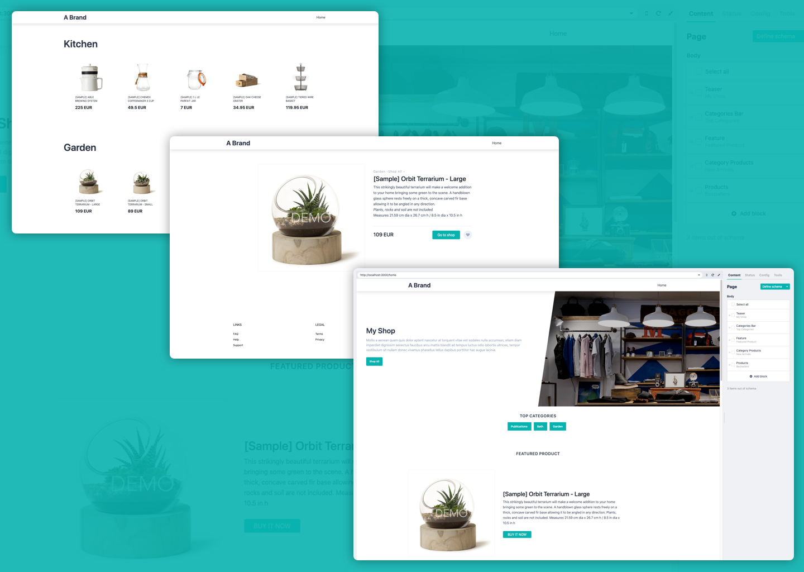

<h1 align="center">Storyblok BigCommerce Shop Template</h1>

<p align="center">
Demo: <a href="https://storyblok-storefront-nuxt.vercel.app/">storyblok-storefront-nuxt.vercel.app/</a>
</p>

<p align="center">
  <a href="https://www.storyblok.com/" rel="noopener">
 </a>
  <a href="https://www.bigcommerce.com/" rel="noopener">
 </a>
  <a href="https://nuxtjs.org/" rel="noopener">
  </a>
</p>

<p align="center">

</p>


## 📝 Table of Contents

- [About](#about)
- [Getting Started](#getting_started)
- [Built Using](#built_using)
- [Deployment](#deployment)


## 🧐 About <a name = "about"></a>

This starter makes use of Nuxt, Storyblok, BigCommerce, Tailwind and Slick Carousel to allow you to adapt it to your own needs.


## 🏁 Getting Started <a name = "getting_started"></a>

Before you can use this template you will need to have created a [Storyblok Space](https://app.storyblok.com/#!/me/spaces) and setup a [Big Commerce store](https://login.bigcommerce.com/login) with some products. 

### Prerequisites

Once you setup your Big Commerce store and Storyblok Space, you need to follow these steps:

#### BigCommerce
1. Retrieve a Big Commerce Storefront Token in order to access your Shop Api. You can do [that here on the Send a Test Request section](https://developer.bigcommerce.com/api-reference/storefront/graphql-api-tokens/api-token/createtoken). 
2. The `X-Auth-Client` and `X-Auth-Token` you will find in your BigCommerce Dashboard under `Advanced Settings` -> `API Accounts`. 
3. The `allowed_cors_origin` should be `http://localhost:3000` if developing locally or `https://plugins.storyblok.com` if used in connection with a Storyblok Integration Plugin. 
4. Once you have the correct token enter it in the `nuxt.config.js`

```bash
# nuxt.config.js
env: {
  storeUrl: 'https://my-demo-store.mybigcommerce.com',
  storeToken: 'super-secret-token',
},
```

#### Storyblok

You will find your Storyblok Token in the `Settings` -> `API-Keys` section of your space. These you will also add to the `nuxt.config.js`.

```bash
# nuxt.config.js
modules: [
  [
    'storyblok-nuxt',
    { accessToken: 'my-preview-token', cacheProvider: 'memory' },
  ],
],
```

### Installing

Once you installed all packages and entered your Storyblok and BigCommerce credentials you can start the development server.

```bash
# install dependeciens
npm install

# start nuxt
npm run dev
```

### Importing Components into your Storyblok Space

The components in `components` will be mirrored in Storyblok so you can change their content. Use the Storyblok CLI to import the components in the `seed.components.json` file into your space.

```bash
# Install Storyblok CLI if you have not already
npm install -g storyblok

# how to use
storyblok push-components <SOURCE> --space <SPACE_ID>

# example
storyblok push-components ./seed.components.json --space 12345
```

### Installing the BigCommerce Field Types


In order to connect to BigCommerce and import the products, you will need to install the Custom Field Types. 


## Deployment <a name = "deployment"></a>

You can generate a deployable directory `dist` by running the following command.

```bash
npm run generate
```


## ⛏️ Built Using <a name = "built_using"></a>

- [Storyblok](https://www.storyblok.com) - Headless CMS
- [Big Commerce](https://www.bigcommerce.com) - Shop System
- [NuxtJS](https://nuxtjs.org) - Vue Static Site Generator
